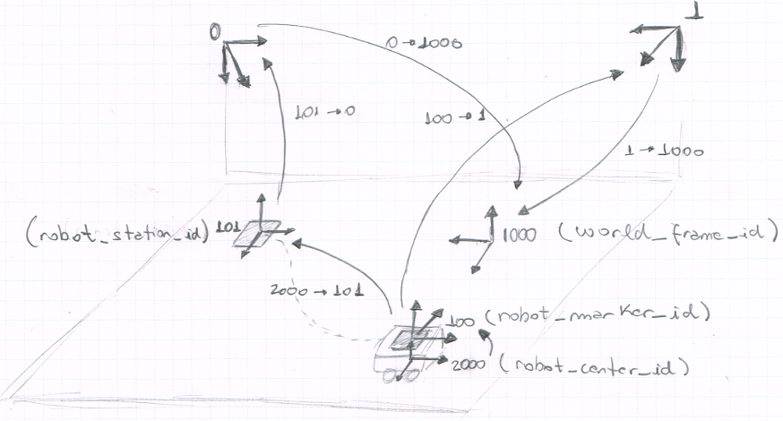

# Controlling MobiLysa

- An **ArUco** marker is located on the ground, visible by at least one of the cameras. This marker locates the robot station, labeled as `robot_station_id`.
- MobiLysa **must** be place aligned with `robot_station_id<101>` before any interaction and controlling task.
  - Alignment error can be estimated using **is-frame-transformation** service, retrieving transformation between `<100>` and `<101>`.
- MobiLysa's gateway:
  - Has a coordinate referential frame aligned with its pose's center (`robot_center_id<robot_id+2000=2000>`).
  - On its configuration, contains the `x`, `y` and `z` displacement between `robot_center_id<2000>` and the marker (*ArUco*) attached with it, `robot_marker_id<100>`.
  - Has a service for registration (`RobotGateway.{robot_id<0>}.Register`). The service's topic receives a message with a `robot_station_id<101>`, and then:
    - Starts to subscribe the transformation between `robot_station_id` and `world_frame_id`.
    - Stores current pose.
  - At each new computed pose, publishes a `FrameTransformations` message containing the transformations listed below, on a topic `RobotGateway.{robot_id<0>}.FrameTransformations`:
    -  `robot_station_id<101>`→`world_frame_id<1000>`, updated on every new message received.
    -  `robot_center_id<2000>`→`robot_station_id<101>`, computed as in [this](https://github.com/labviros/is-pepper-gateways/blob/master/robot-gateway/driver.py#L158) example.
    -  `robot_center_id<2000>`→`robot_marker_id<100>`, computed using displacement configuration given on gateway's configuration.
- The service **is-robot-controller**:
  - As usual, consumes transformations from topic `FrameTransformation.{robot_marker_id}.{camera_id}.{world_frame_id}` from all available cameras.
  - Also consumes from topic `FrameTransformation.{robot_marker_id<100>}{robot_center_id<robot_id+2000=2000>}.{world_frame_id<1000>}`, when on its configuration, `.parameters.use_odometer_pose=true`. This is also conditioned by robot gateway's availability, that can be periodically checked retrieving its configuration on topic `RobotGateway.{robot_id}.GetConfig`, similar with what is done to check available cameras.